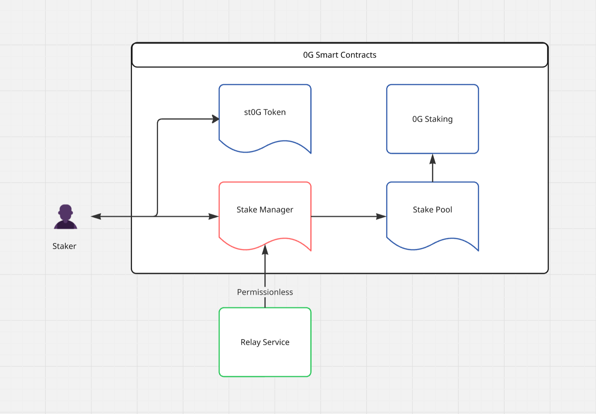
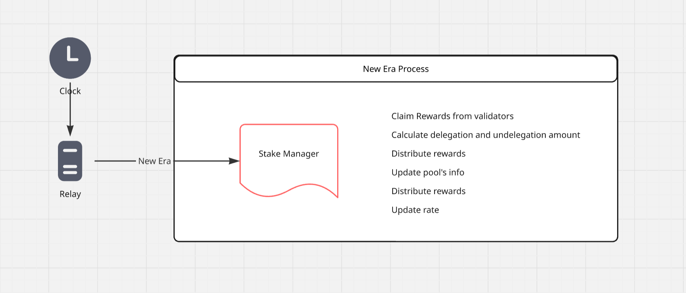
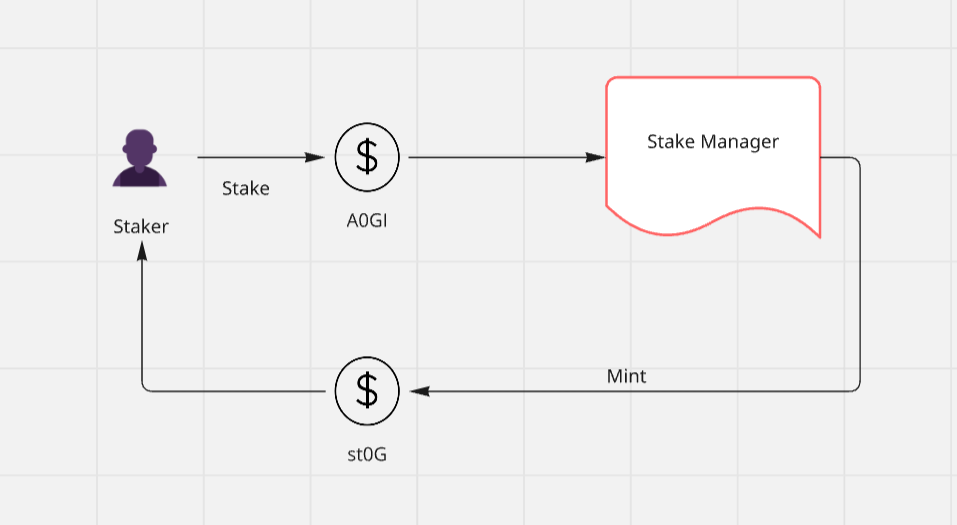
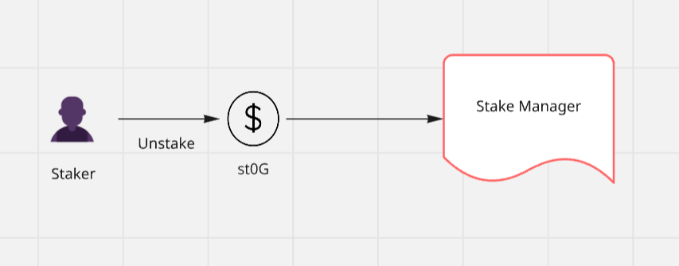
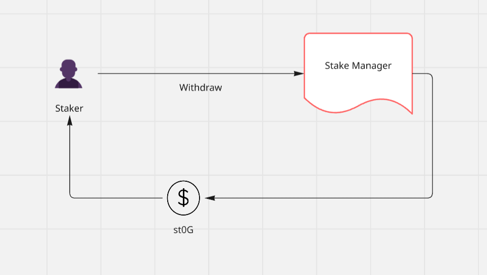

# Gimo Architecture

Gimo Finance's liquid staking derivatives (LSD) system is built on top of the EVM LSD Stack from StaFi's AI-powered LSaaS that enables users to stake their native tokens and receive liquid staking derivatives in return. This system provides users with enhanced liquidity while maintaining their staking positions and rewards.



## Core Components

The core components form the foundation of Gimo Finance's infrastructure, comprising smart contracts, relay network, and user interface that work together to provide a seamless staking experience.

### Smart Contracts

The Gimo Finance ecosystem consists of several key smart contracts:

- **StakeManager**: The central contract that orchestrates staking operations, manages validator selection, and handles reward distribution.
- **StakePool**: Acts as the primary interface for user interactions, managing fund flows between stakers and the native staking protocol.
- **LsdToken**: The liquid staking derivative token contract that represents staked positions and enables DeFi composability.

### Relay Service

The Relay Service is a decentralized service that:

- Automates contract interactions to mitigate smart contract shortage
- Ensures continuous system operation
- Maintains system health through regular updates
- Operates in a permissionless manner



### User Interface

The User Interface provides:
- Intuitive staking and unstaking operations
- Real-time position tracking
- Reward monitoring
- Seamless DeFi integration

## Operational Flows

The operational flows define the key processes that users interact with, including staking, unstaking, and reward distribution mechanisms.

### Staking Process



Users can stake their native tokens through the `stake` function, receiving LSD tokens in return. The conversion rate is calculated as:

```
LSD Amount = Stake Amount * Total LSD / Staked Native Tokens
```

Where:
- `LSD Amount`: Amount of LSD tokens minted
- `Stake Amount`: Amount of native tokens staked
- `Total LSD`: Total LSD tokens in circulation
- `Staked Native Tokens`: Total native tokens locked in the system

### Unstaking Process



st0G holders can initiate unstaking through the `unstake` function, which:
1. Burns st0G tokens
2. Initiates the unbonding process
3. Waits for the unbonding period

### Withdrawing Process



Users can withdraw their staked A0GI tokens and rewards by calling the withdraw method after the unbonding period has elapsed.

## System Features

The system features outline the key operational characteristics and capabilities that enable efficient and reliable staking operations.

### Era-based Operations

The era-based operations system provides a structured framework for managing staking cycles and validator activities. Each era represents a fixed time period during which validators are active and rewards are accumulated. This system ensures predictable reward distribution and maintains network security through regular validator rotation.

### Rate Management

Rate management is crucial for maintaining the stability and fairness of the liquid staking system. It involves continuous monitoring and adjustment of exchange rates between A0GI and st0G, with built-in safeguards to prevent sudden value fluctuations and ensure transparent rate tracking.

### Emergency Protocols

Emergency protocols are designed to protect user assets and maintain system integrity during critical situations. These protocols provide multiple layers of protection, including system pause capabilities, emergency withdrawal options, and rapid validator removal procedures, ensuring the system can respond effectively to various emergency scenarios.
